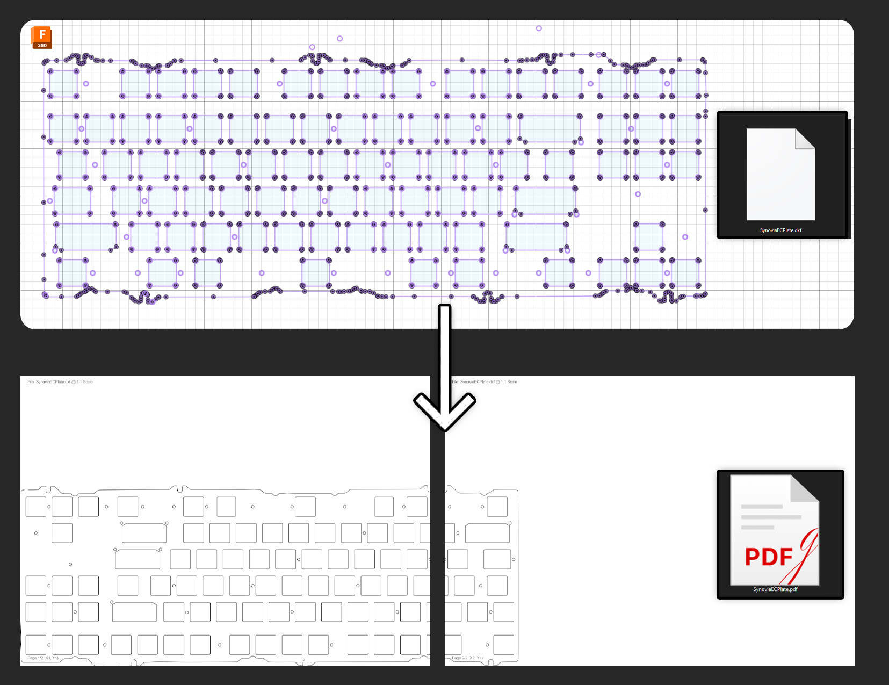

# DXF to A4 PDF Converter

A Python tool to convert DXF files to multi-page A4 Landscape PDFs with 1:1 scale for accurate real-life dimensions.

## Overview

This tool reads a DXF file (commonly used for CAD drawings) and generates a PDF output tiled across multiple A4 Landscape pages if necessary. It's designed to preserve the original dimensions of the drawing, ensuring that measurements in the PDF match real-world sizes when printed at 100% scale.

## Features

- Converts DXF files to PDF with 1:1 scaling
- Supports tiling across multiple A4 Landscape pages for large drawings
- Handles common 2D entities like LINE, CIRCLE, ARC, LWPOLYLINE, POLYLINE, SPLINE, and ELLIPSE
- Includes debug output for troubleshooting

## Requirements

- Python 3.x
- Libraries: `ezdxf`, `reportlab`

Install the required libraries using:
```bash
pip install ezdxf reportlab
```

## Usage

Run the script from the command line with the input DXF file and desired output PDF file paths:

```bash
python a4.py "path/to/input.dxf" "path/to/output.pdf"
```

Ensure you replace `path/to/input.dxf` and `path/to/output.pdf` with the actual file paths.

**Important:** When printing the PDF, select "Actual Size" or "100% Scale" in your printer settings and disable any "Fit to Page" options to maintain accurate dimensions.

## Example

This script takes a DXF file, like the keyboard plate design shown below (top), and converts it into a multi-page PDF (bottom) that can be printed at 1:1 scale for prototyping or manufacturing checks.



After searching for the plate file for my custom keyboard, 'Synovia', I couldn't find it online as it wasn't publicly available and my specific iteration is discontinued. My only option was to design it from scratch. Since this was my first time creating such a part, although it looked correct on screen, I wanted to verify that the dimensions matched the physical keyboard plate before sending it for manufacturing. This script allowed me to print a 1:1 scale version for that crucial check.

## Limitations

- Currently supports a limited set of DXF entity types (focus on 2D geometry)
- May not render complex entities or block references fully
- Assumes DXF units are in millimeters (mm)
- Not perfect, don't use it as a final check for your projects.

## License

This project is licensed under the MIT License - see the [LICENSE](LICENSE) file for details.

## Contributing

Feel free to submit issues or pull requests for improvements or additional entity support.
